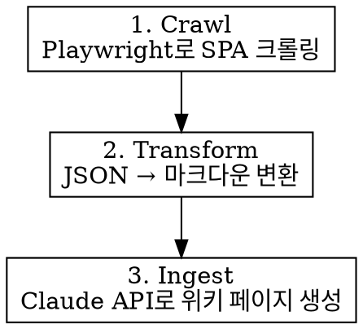

# Web Ingest for LLM-Wiki

## Overview

SPA(Single Page Application) 포함 웹 페이지를 크롤링하여 LLM-wiki 지식 베이스에 수집하는 스킬.
WebFetch는 JS 렌더링이 안 되므로, Playwright 헤드리스 브라우저로 실제 렌더링된 콘텐츠를 추출한다.

## When to Use

- 웹 URL의 콘텐츠를 LLM-wiki에 지식화할 때
- SPA(Vue, React, Angular 등 hash 라우팅 사이트)를 크롤링할 때
- WebFetch로 "IE 호환성 안내" 같은 빈 껍데기만 반환될 때

## When NOT to Use

- 이미 텍스트/PDF 파일이 있을 때 (직접 Ingest API 사용)
- API 문서가 별도 제공될 때 (API를 직접 호출)

## 3단계 프로세스



## Step 1: Crawl (크롤링)

크롤러 스크립트 위치: `skills/llm-wiki-web-ingest/crawl-spa.js`

```bash
# 기본: 베이스 URL + 자동 링크 탐색
node skills/llm-wiki-web-ingest/crawl-spa.js "https://example.com/#/customer" \
  --output ./crawled \
  --wait 3000 \
  --depth 2

# 하위 경로 명시
node skills/llm-wiki-web-ingest/crawl-spa.js "https://example.com/#/docs" \
  --sub-paths "guide,api,faq,terms" \
  --output ./crawled
```

| 옵션 | 기본값 | 설명 |
|------|--------|------|
| `--output` | `./crawled` | 결과 저장 디렉토리 |
| `--wait` | `3000` | SPA 렌더링 대기 시간 (ms) |
| `--depth` | `1` | 링크 탐색 깊이 (2 이상이면 발견된 링크도 재귀 크롤링) |
| `--sub-paths` | 없음 | 쉼표 구분 하위 경로 목록 |

출력: 페이지별 JSON 파일 + `_summary.json`

## Step 2: Transform (변환)

크롤링된 JSON을 읽고 마크다운으로 변환한다. Claude Code에서 직접 수행:

```
1. _summary.json 읽어서 크롤링된 페이지 목록 확인
2. 각 JSON 파일을 읽어서 content 필드 추출
3. 페이지별로 마크다운 정리:
   - 제목 (title)
   - 본문 (content → 마크다운 포맷)
   - 테이블 (tables → 마크다운 테이블)
   - 출처 URL
4. 전체 내용을 하나의 문서 또는 페이지별 문서로 병합
```

## Step 3: Ingest (위키 등록)

변환된 마크다운을 LLM-wiki의 Ingest 파이프라인에 전달:

```
1. 변환된 마크다운을 /api/sources에 POST (raw_source로 저장)
2. /api/ingest에 POST (source_id 전달)
3. Claude API가 위키 페이지 생성/업데이트
4. 크로스레퍼런스 자동 삽입
```

앱이 아직 미구현이면, 변환된 마크다운을 `llm-wiki/raw-sources/` 디렉토리에 파일로 저장해둔다.

## 크롤링 실패 시 대안

| 상황 | 대안 |
|------|------|
| Playwright 미설치 | `npx playwright install chromium` |
| 로그인 필요 사이트 | 크롤러에 `--cookies` 옵션 추가하거나, 브라우저에서 수동 복사 |
| CAPTCHA 차단 | 수동으로 페이지 내용 복사 → 텍스트로 Ingest |
| 콘텐츠 너무 적음 | `--wait` 시간 늘리기 (5000~10000ms) |
| robots.txt 차단 | 사이트 관리자에게 허가 요청 |

## Common Mistakes

- WebFetch로 SPA 크롤링 시도 → JS 미렌더링으로 빈 콘텐츠 반환
- `--wait` 시간 너무 짧으면 SPA 렌더링 전에 추출됨
- depth를 너무 높이면 외부 링크까지 크롤링 → 1~2 권장
